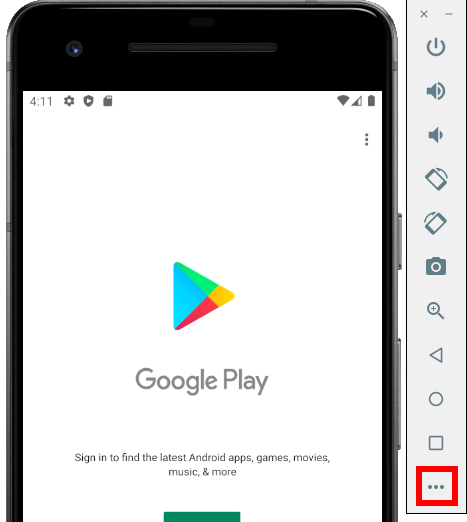
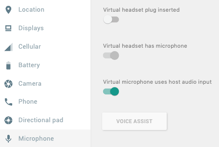
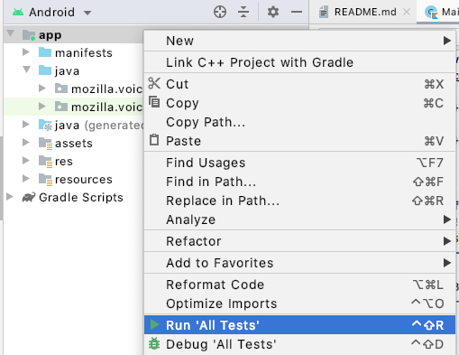
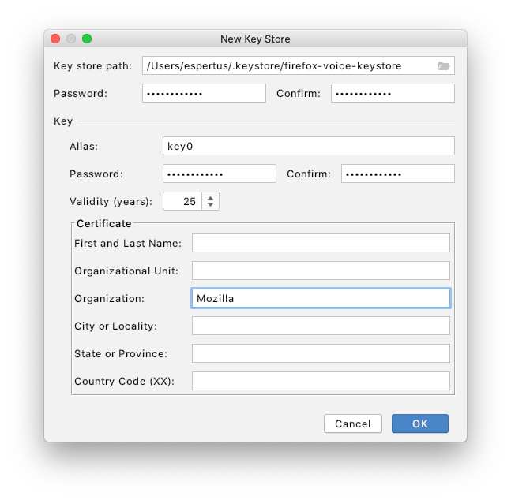
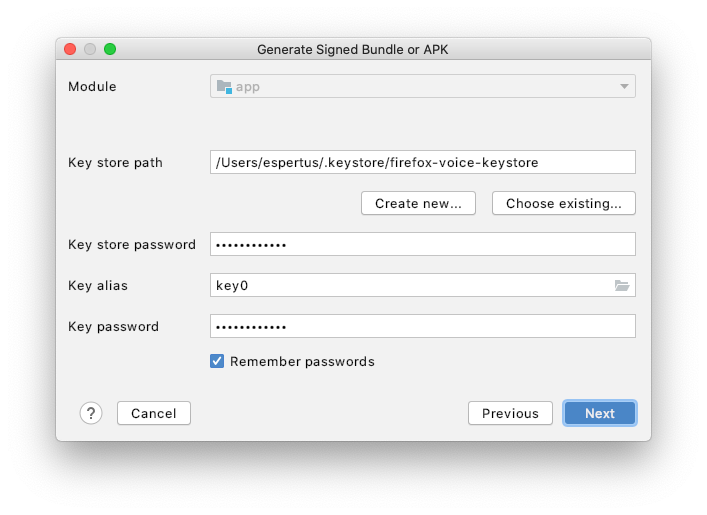
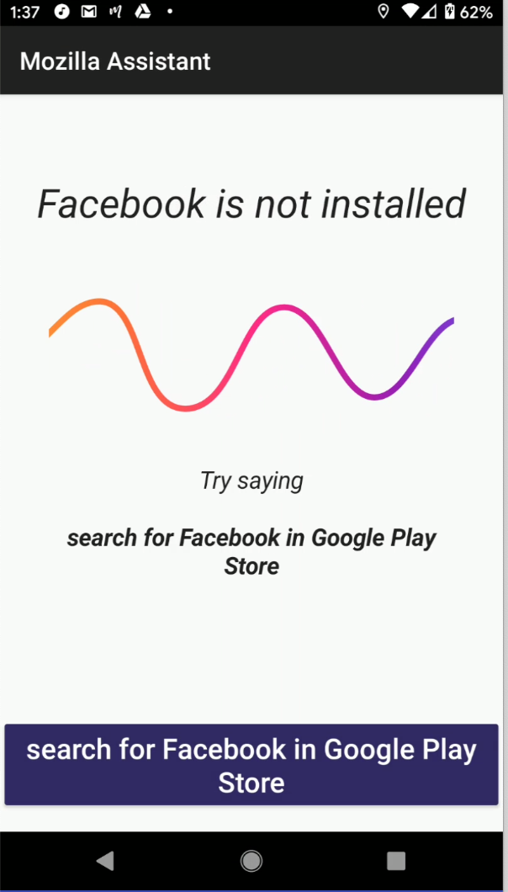

# Firefox Assistant

  * [User guide](#user-guide)
    + [Enable installation of apps from unknown sources](#enable-installation-of-apps-from-unknown-sources)
    + [Install the Mozilla Assistant app](#install-the-mozilla-assistant-app)
    + [Specify your assistant](#specify-your-assistant)
    + [Using Mozilla Assistant](#using-mozilla-assistant)
  * [Developer guide](#developer-guide)
    + [Android Studio](#android-studio)
    + [Using an Emulator](#using-an-emulator)
    + [Style](#style)
    + [Testing](#testing)
    + [Generating a signed build](#generating-a-signed-build)
    + [Adding an intent](#adding-an-intent)
      - [Create TOML](#create-toml)
      - [Implement an IntentBuilder](#implement-an-intentbuilder)
      - [Register the Intent](#register-the-intent)

## User guide

We recommend opening this page (https://bit.ly/3dekxLZ) in Firefox on Android.

### Enable installation of apps from unknown sources

On older versions of Android (before Oreo), select `Settings` > `Security` (or `Lock screen and security`), then enable the switch next to `Unknown sources`.

On recent versions of Android, follow the instructions illustrated below, in the linked images, or in [this screencast](https://github.com/mozilla/firefox-voice/mozilla-assistant/blob/master/doc/unknown-sources25.gif):

   1. Open Settings and enter "unknown" in the Settings search bar ([image 1](
   https://github.com/mozilla/firefox-voice/raw/master/android-app/doc/unknown-sources1.png)).
   2. Click on "Install unknown apps" ([image 2](https://github.com/mozilla/firefox-voice/raw/master/android-app/doc/unknown-sources2.png)).
   3. Click on your browser (e.g., Firefox) ([image 3](https://github.com/mozilla/firefox-voice/raw/master/android-app/doc/unknown-sources3.png)).
   4. Enable installation of apps from unknown sources by dragging the slider right ([image 4](https://github.com/mozilla/firefox-voice/raw/master/android-app/doc/unknown-sources4.png)).


### Install the Mozilla Assistant app

In Firefox, download the [APK (app)](https://github.com/mozilla/firefox-voice/blob/master/android-app/app/release/app-release.apk?raw=true) (by opening the link) on your Android device. Confirm that you wish to open and install it. If Firefox won't let you, use Chrome for this step. If asked if you want to enable Play Protect, decline.

### Specify your assistant

1. Open `Apps & Notifications` > `Advanced` > `Default Apps`.
2. Click on `Assist app`to open the `Assist & voice input` menu.
3. Click on `Assist app`.
4. Select `Mozilla Assistant`.

### Using Mozilla Assistant

After installation, hold down the Home button to open the app, then state your request/question, such as:

 * "Open the Washington Post."
 * "Set an alarm for 5:30."
 * "Call Julia."

## Developer guide

### Android Studio

After cloning the project:

1. Open Android Studio.
2. Select `Import project (Gradle, Eclipse ADT, etc.)`.
3. Open `firefox-voice/android-app`.

This will start building the project and will notify you of anything else you need to download, which you can do through `Tools > SDK Manager`.

### Using an Emulator

Not all emulator AVDs handle speech recognition correctly. We have tested this configuration:

1. Open `Tools > AVD Manager`.
2. Click on `Create Virtual Device...`
3. For device definition, select `Pixel 2` with Play Store.
4. For system image, select Release Name `R (API Level 30)`.
5. Give it any name. I used the default "Pixel 2 API 30".
6. Open the emulator from the command line. On OS X, you can do: `~/Library/Android/sdk/emulator/emulator @Pixel_2_API_30 -dns-server 8.8.8.8 &`
7. Click on the ellipsis (...) to the right of the emulator to change its settings. 
8. Select `Microphone`, then enable `Virtual microphone uses host audio input`. 
9. Test that you can do a Google voice search on the emulated device.
10. In Android Studio, launch the app on the emulator by setting the shown dropdown menus to "app" and "Pixel 2 API 30" and pressing the play button. 

### Style ###
We follow the style enforced by [ktlint](https://ktlint.github.io/) and [detekt](https://arturbosch.github.io/detekt/). See [how to configure Android Studio appropriately](https://github.com/pinterest/ktlint#option-1-recommended).

To check your style, run:

```
./gradlew ktlintCheck
./gradlew detekt
```

### Testing ###
You are expected to both add tests for code that you write and make sure that your changes do not
cause existing tests to fail. You can run tests in Android Studio by right-clicking on `app` in the Project Pane and selecting `Run 'All Tests'`. 

### Generating a signed build ###
When you change the code, you should also [build a signed APK](https://developer.android.com/studio/publish/app-signing#sign-apk). Here is a summary of the steps:

1. In Android Studio, select `Build > Generate Signed Bundle/APK...`.
2. In the wizard, select `APK`. 
3. Choose an existing key store or create a new one. When specifying the key store path, if you are on a Mac, you may find it helpful to press Command+Shift+. to show hidden directories. If you create a new key store and key, don't worry too much about what you enter into the `New Key Store` wizard. You can always create a new key if you need to. Android Studio will remember (but not check in) the information about the key store for the next times you build the APK.  
4. Select `release` and `V2 (Full APK Signature)` on the next dialog. 

If someone wants to replace an app signed by a different key, they will need to uninstall it before installing the new one.

### Adding an intent ###

Adding a voice intent (not to be confused with an Android [`Intent`](https://developer.android.com/reference/android/content/Intent) requires these steps:

#### Create TOML ####

Create or add a description of the intent to either an existing TOML file or a new TOML file in the [assets directory](https://github.com/mozilla/firefox-voice/tree/master/android-app/app/src/main/assets). See [Writing an Intent](https://github.com/mozilla/firefox-voice/blob/master/docs/writing-an-intent.md) for the TOML format.

#### Implement an IntentBuilder ####
In an existing or new class in a [mozilla.voice.assistant.intents](https://github.com/mozilla/firefox-voice/tree/master/android-app/app/src/main/java/mozilla/voice/assistant/intents) subpackage, write an [`IntentBuilder`](https://github.com/mozilla/firefox-voice/blob/master/android-app/app/src/main/java/mozilla/voice/assistant/intents/IntentRunner.kt#L104).

An `IntentBuilder` takes arguments of the following types:

* [`ParseResult`](https://github.com/mozilla/firefox-voice/blob/master/android-app/app/src/main/java/mozilla/voice/assistant/intents/IntentParser.kt#L33), from which it can retrieve slot and parameter values.
* `Context?`, in case it needs one to generate the output `Intent`. The only time the value may be null is during tests.
* [`Metadata`](https://github.com/mozilla/firefox-voice/blob/master/android-app/app/src/main/java/mozilla/voice/assistant/intents/Metadata.kt), in case any of its information is needed (which is currently only the case for the [launch.install intent](https://github.com/mozilla/firefox-voice/blob/master/android-app/app/src/main/java/mozilla/voice/assistant/intents/apps/Launch.kt).

It returns an `Intent` satisfying the request, or `null` if it is unable to. Look at existing files for examples, such as [Alarm.kt](https://github.com/mozilla/firefox-voice/blob/master/android-app/app/src/main/java/mozilla/voice/assistant/intents/alarm/Alarm.kt).

Usually, the produced `Intent` is handled by a separate app. For example, requests to set an alarm generate an `Intent` whose `action` is [`ACTION_SET_ALARM`](https://developer.android.com/reference/android/provider/AlarmClock#ACTION_SET_ALARM); however, this is not always the case.

In the user makes a nontrivial communication request (e.g., "call Mom" or "text Keith hello"), [PhoneCall.kt](https://github.com/mozilla/firefox-voice/blob/master/android-app/app/src/main/java/mozilla/voice/assistant/intents/communication/PhoneCall.kt) or [TextMessage.kt](https://github.com/mozilla/firefox-voice/blob/master/android-app/app/src/main/java/mozilla/voice/assistant/intents/communication/TextMessage.kt) generates an intent to launch [`ContactActivity`](https://github.com/mozilla/firefox-voice/blob/master/android-app/app/src/main/java/mozilla/voice/assistant/intents/communication/ui/contact/ContactActivity.kt), which is within the app.

If the user makes a request to launch an app (e.g., "launch Facebook"), there are two types of `Intent`s that could be generated by [Launch.kt](https://github.com/mozilla/firefox-voice/blob/master/android-app/app/src/main/java/mozilla/voice/assistant/intents/apps/Launch.kt):

1. If the app is installed, a launch intent will be created.
2. If the app is not installed, an intent will be created to open `MainActivity` with:
      * feedback (e.g., "Vacebook is not installed")
      * a suggestion (e.g., "search for Facebook in Google Play Store")

The latter will cause the `MainActivity` to start not with the ordinary text but with the suggestion shown and on a button:



#### Register the Intent ####

Write a static function `getIntents()` that returns a `List<Pair<String, IntentBuilder>>` mapping intent names from the TOML file (e.g., "alarm.setAbsolute") to `IntentBuilder` methods. Examples can be found in almost every file one directory below [mozilla.voice.assistant.intents](https://github.com/mozilla/firefox-voice/tree/master/android-app/app/src/main/java/mozilla/voice/assistant/intents).

Modify the `initializeData()` method in [MainActivity](https://github.com/mozilla/firefox-aoice/blob/master/android-app/app/src/main/java/mozilla/voice/assistant/MainActivity.kt) to call the new `getIntents()` function.
